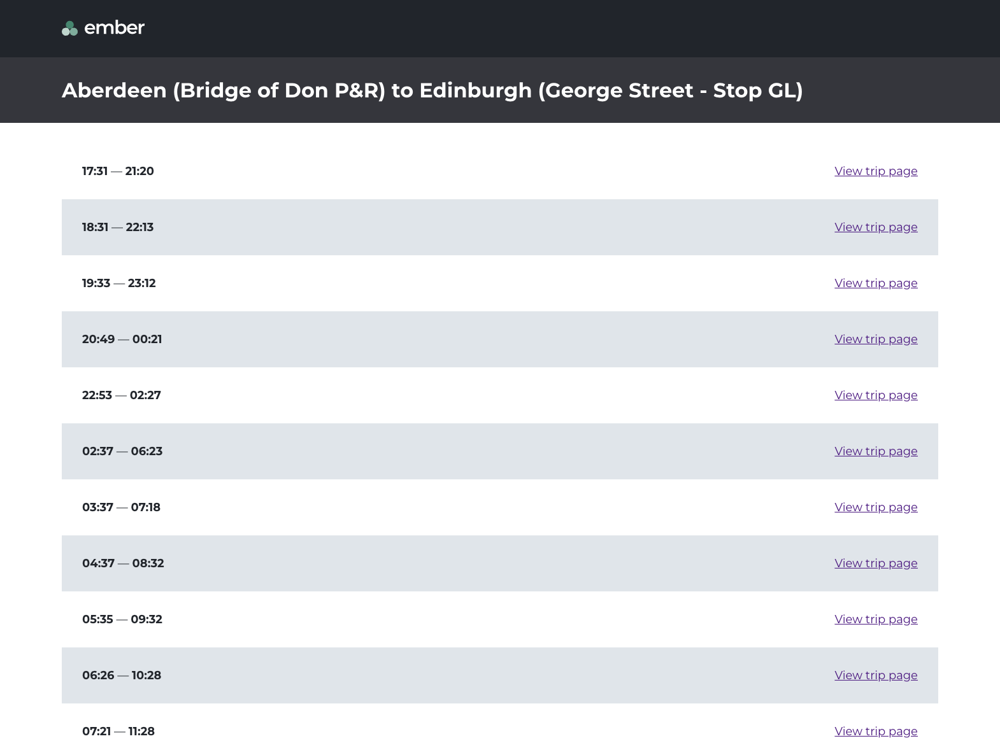
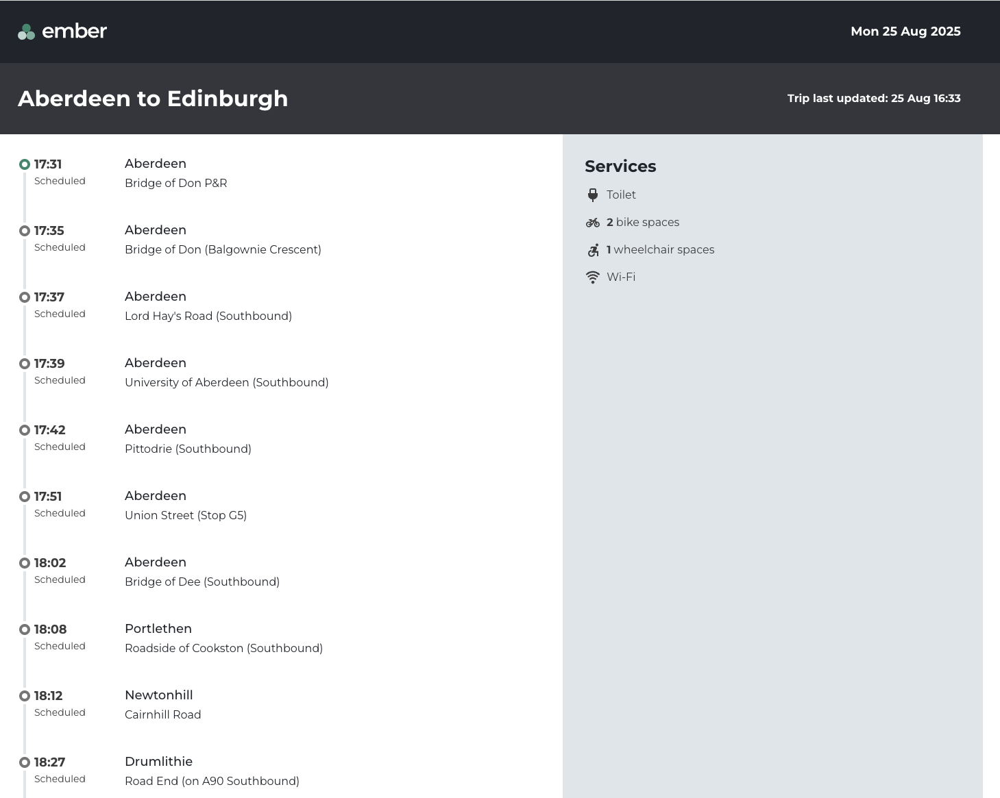
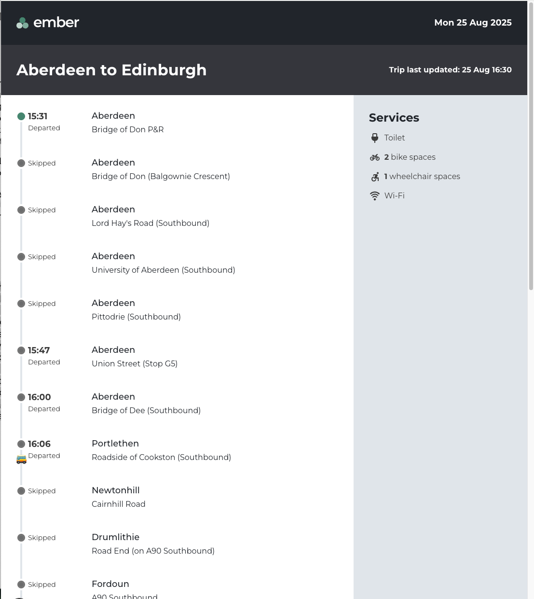

## Getting Started

First, run `npm install` to install all dependencies locally.
Then you can run the development server

```bash
npm run dev
```

## What is this?

This is a simple app that shows a list of available bus services between Aberdeen and Edinburgh, departing from today and until tomorrow and allows you to navigate to a trip page to see more info on all the stops in the trip and some vehicle data.







## Context

Since I've had my family over for holidays and I was also on holidays, my available time was scarce so I had to limit working a couple of hours a day, sometimes three.
I wanted to set a time limit of 8h but I'm sure I've done probably 4h more than I wanted, as also writing this README.md is taking me a while now.

To be fair, I've had a lof of fun developing this small app, and it was also time for to escape my very spanish family and enjoy some quiet time 😅

Full disclosure that I will definitely forget things to talk about in this README.md so if you have any questions please let me know at diana.hercas@gmail.com

## Tools

I decided to give Cursor (code editor) a go for this test. I'm not a fan of vibe coding or chatgpt but I wanted to see how useful it would be to, for example, create typescript interface and types based on the data returned on the endpoints. I love writing code but honestly, typing a big object was going to take me a while. I still had to double check everything but that was useful.

I checked Ember's APIs documentation and the current Ember site quite a lot: I wanted to double check the endpoint results, make sure I was passing the right payload, etc...

I got your logo and a few of the icons too, as well as some styling values (color, fonts, etc...)

I used some pen and paper to scribble a few layout ideas but nothing fancy.

## Decisions I made

- After reading the Trip Page Project PDF, I decided to focus on just the trip page and basically hardcoded which trip I was going to be showing in the app, but towards the end of the excercise I decided to implement first a list of the available quotes and then just link different trips, just to try the next.js dynamic pages.
  All in all this is a simple app just rendering information from the BE and not allowing interaction with the data at all.

- The first thing I did was actually checking one of my fav interfaces when it comes to show trip information: Trainline. I really like the way they show the stops and the info they provide. I also checked a few other providers, just curious about what sort of data they show, and I also ask my parents about what they would normally check on an active journey.

  I made a few sketches then on paper and then decided that the use case would be of a person who's in a bus that's currently travelling from Aberdeen to Edin and can see on a page when the next stop is scheduled, the basic info about the vehicle and the ETA of the final destination, plus the approx bus location.

  I decided also not to sopend too much time on the geolocation part of the work based on what the PDF suggested.

- I decided to give Next.js a go. I have been using React for the last 6 years so I haven't had much exposure to other frameworks. I may have shoot myself in the foot with this decision but I was quite curious to see if the SSR and a few of the other built-in features would be useful in this particular app.

- I've been using CSS in JS the last 6 years I thought it would be cool to just use plain old css with a pre-processor like SASS to take advantage of a few things, but to be fair, I could have probably achieved the same result with plain css. I decided to go for class based styling. This way we could always extract the css and serve it from a cdn if we wanted to have another static site using this css. I actually had some problems with scss and turbopack (hot reload doesn't quite work yet) so I got rid of the turbopack option.

- As suggested I hardcoded the getAllQuotes enpoint and I decided to create the home page as a server component.

- Fetch api data (hardcoded now, check what's best in terms of server component vs client component) Ideally we would like to maybe get a dedicated endpoint where we can get the stream of the geoposition or do the polling from the FE with ssr so we just get the gps info updated if the endpoint allows that. Something that will allow the fe to not re-render everytime the gps position changes basically, and doesn't stress the endpoint.

## Things that could be done better

I knew that this app wouldn't be perfect, of course, and there's probably decisions I made that may need to be reverted or changed for better ones, but I've tried to think about approaches that might be better to ensure the app runs smoothly for the users, even when having poor internet connections and to make sure that the services don't die because of too many calls or too much pressure on the endpoints.

### Data, Performance and Error handling

I decided to go for server components but I actually think that probably for the trip info page might be best to use a client-side component that can be refreshed at real time (maybe Websockets?) by an api that allows for the FE to poll for changes without having to load the whole object. Would be good to get the geolocation as up to date as possible but we don't need to get the stop names refreshed all the time. To be honest, I've never had to implement something like this personally, so this is definitely not my expertise. Maybe a BFF would be useful to have a middle layer to work on the caching and doing the data transformations.

Ideally, we want to just fetch the data once, prerender what we can and maybe just refresh the parts of the data that are less likely to change whilst making sure that critical data for geolocation and estimated times are always up to date.

I assume it should be possible to cache that data and have a service worker to keep the last successfull request in case connection drops for the user.

I didn't really deal with all the error handling but I should:

- Check for 400 and 500 errors on the API calls (any errors about bad api requests, unauthorized, etc..) and timeouts.
- Make sure there are fallbacks for those errors
- Handle the offline scenario (making sure the user knows when this happens and when they are back online)

### UI & UX

My approach was quite a simple one: for me the most important part on my approach on the test was showing all the stops and the scheduled times for those.

I kept trying to imagine what other information I would want to know if I had been in a bus on my way back to Edin from Aberdeen (that was my use case) so really the stops and any info about possible delays would be the most useful stuff.

I decided to create a sort of timeline, but is just a simple list of stops and I decided to show the scheduled arrival time of all stops and if the trip happens to have started you'll be able to see a bus icon showing in between what stops the bus is.

- At the moment the SSR takes a second to show the quotes list so maybe adding a loading screen or showing something preloaded would be nice, and same withe the links to the trip info pages as they seem to take a few miliseconds to actually load the page.
- Bear in mind that I just added the list of quotes at the end of the test so it looks horrible, so just take it as just a list of trips to choose from.
- Adding the time to the left of the stop circle, I think it would look better
- Adding tooltips for info such as if boarding/drop-off is allowed, maybe how many mins late if service is running late...
- Adding an alert component to show info if trip has been cancelled or delayed or any other issues that could affect the trip.
- Links to map location of the stops for people to open on google maps or their preferred maps app
- Possibly hiding skipped stops by default so the timeline is not that long but allowing user to expand, or maybe even grouping blocks of stops but also allowing to expand to see all.
- Realised I forgot to add the seat count info, but basically just having all the info about the vehicle including name (that contains the license plate)
- I'm hardcoding the locale but I can see now that the time zone is returned to that could be used in the utils I created to transform the dates. I'm assuming we want to show the dates on the local time.
- Making sure the user knows when page if offline and showing the last scheduled time accordingly (atm is just showing the time the user refreshes the page)
- My CSS approach is quite a simple one but could be better by using more variables in a better way and definitely having mixins for mediaqueries. The approach basically responds to the fact that I didn't have to work with a design system or components library.
- Accessibility: things like color contrast, screen reader and keyboard navigation I haven't really checked. I did try to use as semantic HTML as possible and deciding to have full circles for completed stops and empty circles for schedule as I don't think color change would be useful if user is color blind.
- Adding contact information for Ember so the user can ask any questions and links to the FAQ or any other pages that would be useful.

....and plenty more things I'm probably forgetting about

### Testing & Observability

As you can tell, I don't tend to do TDD. I usually work on features or functions and it will be after I've written some functionality that I start then writing tests but this time at the end of the allocated time I had, I had only created unit tests for the small util functions and one test that I actually decided to delete because I realised it was not going to work this way.

- I would definitely unit test the function that compares the dates (but I would move the function somewhere else first)
- I would probably create e2e tests with playwright to test the app and the flow, as oposed to unit test the home page and the trip info page.
- Would be brilliant to run a11y/performance checks in CI pipeline.

Probably think about what sort of metrics would be useful to check: status of service, latency, error rate, etc...
